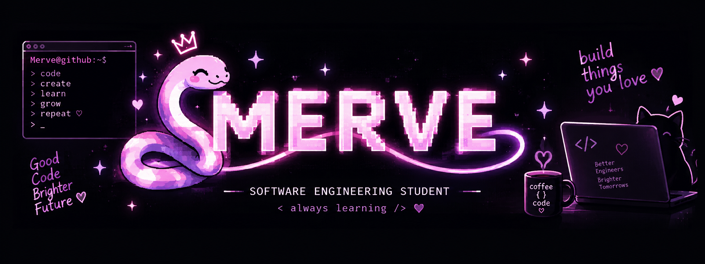

  

# 👋 Hi, I'm Merve Kedersiz!

📍 Istanbul, Türkiye
🎓 Software Engineering @ FSMVU
☕ Java lover | 🐍 Python enthusiast | 🚀 Builder

---

### 🛠️ Tech I Use

☕ **Java** • 🌱 **Spring Boot** • 🐍 **Python** • ⚡ **JavaScript**
🔵 **C/C++** • 🗄️ **SQL** • 📱 **Flutter** • 🐳 **Docker**
🐘 **PostgreSQL** • 🐬 **MySQL** • 🔧 **Git**

---

### 🚀 Things I've Built

🎟️ **TicketLoop – BiletPazarı**
🤖 **Financial Sentiment Analysis**
🛒 **Meres E-Commerce Platform**
📋 **Task & Project Management System**
🎓 **Learning Management System**
🏫 **State Education Tracking System**
🚂 **Train Loading System**
🎮 **Treasure Hunt Adventure Game**

---

### 🌱 Currently

💻 Building backend projects
🤖 Exploring Machine Learning
🔐 Learning Cybersecurity
☕ Drinking coffee & debugging... probably 😅

---

### 🐍 My Contributions

---

### 📫 Let's Connect!

📧 **[mervekedersiz3@gmail.com](mailto:mervekedersiz3@gmail.com)**
💼 [LinkedIn](https://www.linkedin.com/in/mervekedersiz)
🐙 [GitHub](https://github.com/mervekedersiz)

> ✨ *Code. Learn. Break things. Fix them. Repeat.* 🚀

